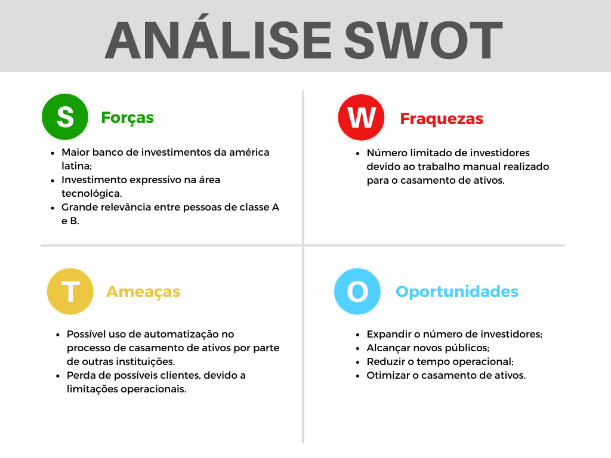

O arquivo abaixo contém uma breve descrição do o entendimento do grupo referente ao problema proposto pelo parceiro de projeto e o mapeamento através de algumas ferramentas de negócio para a solução do problema.

# Entendimento do Negócio

## 1. Contexto da Indústria

### 1.1. Descrição da Indústria

A indústria bancária é um setor amplo e diversificado, ao qual engloba uma variedade de serviços financeiros, seja para pessoas físicas ou jurídicas. Algumas das principais atividades realizadas neste setor são: empréstimos, financiamentos, investimentos, seguros, entre outras. Classificando as atividades realizadas no setor, podemos descrevê-la da seguinte forma:

- Intermediação financeira: atividade de captação de recursos e empréstimos, transferências entre contas e instituições, financiamentos, câmbio e investimentos.

- Gestão de Recursos: atividade relacionada a administração de fundos de investimentos, carteiras de títulos, assessoria financeira e gestão de patrimônio, previdência privada, seguros, entre outros.

- Serviços de pagamento: atividade relacionada a transferências, pagamentos, cartões de crédito e débito, processamento de transações, gestão de contas correntes, entre outros.

Além destes serviços, que são os mais populares e abertamente falados, a indústria também atua com atividades como _leasing_, serviços de _factoring_, consultorias financeiras para empresas, gestão de bens e ativos e muitas outras.

Com a evolução da tecnologia, a indústria bancária tem passado por uma transformação digital, que tem impactado diretamente na forma como os serviços são oferecidos e consumidos. A transformação digital tem permitido que os bancos ofereçam serviços mais personalizados, com maior segurança e eficiência, além de permitir que os clientes tenham acesso a uma gama de serviços financeiros de forma remota, sem a necessidade de ir até uma agência bancária.

Esse crescimento através da transformação digital abriu espaço para uma nova gama de serviços e produtos, como _fintechs_ e _insurtechs_, que são empresas que oferecem serviços financeiros e de seguros, respectivamente, de forma digital e inovadora. A transformação digital também tem permitido que os bancos tradicionais se reinventem e ofereçam serviços mais modernos e inovadores, como a oferta de crédito e investimentos de forma digital, além de permitir que os clientes tenham acesso a uma gama de serviços financeiros de forma remota, sem a necessidade de ir até uma agência bancária.

Por conta disso, fez-se necessário aprimorar e tornar mais rigorosas as leis e regulamentações do setor, para garantir a segurança e a privacidade dos dados dos clientes, além de garantir a integridade do sistema financeiro. A Lei Geral de Proteção de Dados (LGPD) e a Lei Complementar 105/2001, que trata do sigilo das operações bancárias, são exemplos de leis e regulamentações que foram criadas para garantir a segurança e a privacidade dos dados dos clientes.

Hoje, muitos bancos e _fintechs_ têm seu crescimento de forma muito rápida, tornando-se unicórnios em poucos anos e instituições globais em menos de uma década, como é o caso do Nubank, que foi fundado em 2013 e hoje é uma das maiores instituições financeiras do Brasil e da América Latina.

Através desse contexto, é possível perceber que a indústria bancária é um setor que está em constante evolução e transformação, o que tem permitido que novos serviços e produtos sejam oferecidos de forma mais moderna e inovadora, além de permitir que os clientes tenham acesso a uma gama de serviços financeiros de forma remota, sem a necessidade de ir até uma agência bancária.

Partindo deste ponto, o grupo estudou este contexto industrial e criou, com base no modelo das 5 forças de Porter, uma análise do ambiente competitivo da indústria bancária, que pode ser lida a seguir.

### 1.2. O problema

O problema proposto pelo parceiro de projeto é a formação de ativos sintéticos com rentabilidade aproximada de 100% do CDI (Comprovante de Depósito Interbancário).

### 1.3. A solução proposta

A solução proposta para o parceiro de projeto é desenvolver um algoritmo com aprendizado por reforço e _deep learning_ que seja preciso para calcular com precisão as melhores combinações de ativos à vista e a termo, gerando uma taxa ótima nos valores do CDI.

### 1.4. Benefícios da solução

Com a solução proposta em produção na empresa parceira, o objetivo será mitigar a transferência de riqueza, além de oferecer maior assertividade no preço, menor necessidade de intervenção manual e ganho de escala.

Vale ressaltar que o problema, a solução e os benefícios serão apresentados de forma mais detalhada no tópico 3 do documento, com o intuito de oferecer uma visão mais ampla e detalhada sobre o contexto do problema e a solução proposta.

### 1.5. As 5 Forças de Porter

O modelo de análise das 5 forças de Porter é uma ferramenta de gestão que permite analisar o ambiente competitivo de uma indústria. O modelo foi criado por Michael Porter, professor da Harvard Business School, e é amplamente utilizado por empresas e gestores para entender o ambiente competitivo de uma indústria e, assim, tomar decisões estratégicas mais assertivas.

O modelo de análise das 5 forças de Porter é composto por 5 forças que influenciam a competitividade de uma indústria, que são: rivalidade entre os concorrentes, ameaça de novos entrantes, poder de negociação dos fornecedores, poder de negociação dos compradores e ameaça de produtos substitutos. Veja abaixo a análise do ambiente competitivo da indústria bancária com base no modelo das 5 forças de Porter.

#### 1.5.1. Rivalidade entre os concorrentes

A rivalidade entre os concorrentes é alta na indústria bancária, uma vez que existem muitos bancos e _fintechs_ que oferecem serviços financeiros e produtos de investimentos, por conta da disputa por clientes, que buscam por serviços financeiros e produtos de investimentos mais modernos, inovadores e com menores taxas e tarifas e é alta também por conta da disputa por talentos, que buscam por oportunidades de trabalho em empresas que ofereçam um ambiente de trabalho mais inovador e desafiador.

Neste aspecto, o banco BTG Pactual é um dos principais _players_ do mercado, uma vez que é um dos maiores bancos de investimentos da América Latina e oferece uma gama de serviços financeiros e produtos de investimentos, como fundos de investimentos, carteiras administradas, previdência privada, entre outros. Mas tem como concorrentes bancos como Itaú, Bradesco, Santander, Banco do Brasil, Caixa Econômica Federal, Nubank, Inter, entre outros.

#### 1.5.2. Ameaça de novos entrantes

A ameaça de novos entrantes é baixa na indústria bancária, uma vez que o setor é altamente regulamentado e requer um alto investimento inicial para entrar no mercado, o que dificulta a entrada de novos concorrentes. Além disso, a indústria bancária é dominada por grandes bancos e _fintechs_ que já possuem uma grande base de clientes e uma grande rede de agências e pontos de atendimento, o que dificulta a entrada de novos concorrentes. Ainda assim, a entrada de novos concorrentes é possível, uma vez que a transformação digital tem permitido que novas empresas ofereçam serviços financeiros e produtos de investimentos de forma mais moderna e inovadora, mesmo que não seja diretamente um banco. Um exemplo disso é o serviço Mercado Pago, que inicou como uma carteira digital e hoje oferece serviços financeiros e produtos de investimentos.

#### 1.5.3. Poder de negociação dos fornecedores

A indústria bancária tem um alto poder de negociação com os fornecedores, uma vez que os bancos e _fintechs_ são grandes empresas e possuem uma grande base de clientes, o que lhes permite negociar melhores condições com os fornecedores para seus produtos e serviços individual ou simultaneamente. Mesmo os unicórnios dentro dessa indústria, como a Neon em seu início, possuem esta grande influência e poder de negociação, dada a grande quantidade de clientes que possuem.

#### 1.5.4. Poder de negociação dos compradores

Por outro lado, o poder de negociação dos compradores podem não ser tão alto, uma vez que alguns bancos possuem seus serviços e produtos de investimentos modelados como planos para as contas corrente e de investimento, mudando apenas em determinadas situações e por ter, na maior parte das vezes, uma base sólida de clientes fidelizados, ou seja, por muito tempo. Em contrapartida, _fintechs_ como Nubank e bancos digitais, como o BTG Pactual, possuem um poder de negociação maior, uma vez que oferecem serviços financeiros e produtos de investimentos de forma mais moderna e inovadora, o que lhes permite negociar melhores condições com os fornecedores para seus produtos e serviços.

#### 1.5.5. Ameaça de produtos substitutos

A principal ameaça de produtos substitutos na indústria bancária é a transformação digital, que tem feito com que a padronização de planos e serviços bancários seja desbancada por serviços mais personalizados, o que deu ao cliente mais liberdade de escolha do que quer e do que não quer em sua conta. Através disso, falando sobre a área de investimentos, alguns bancos e _fintechs_ tem tirado a obrigatoriedade de uma pessoa intermediando as corretagens e dado mais liberdade para que os titulares das suas contas, se assim desejarem, possam fazer suas próprias corretagens, como é o caso da XP Investimentos, Rico Investimentos e BTG Pactual Digital.

### 1.6. Modelo de Negócios

O modelo de negócios do BTG Pactual é baseado em oferecer serviços financeiros e produtos de investimentos de forma mais moderna e inovadora, o que lhes permite oferecer uma gama de serviços financeiros e produtos de investimentos, como fundos de investimentos, carteiras administradas, previdência privada, entre outros. Além disso, o BTG Pactual também oferece serviços de assessoria financeira e gestão de patrimônio, que são serviços mais personalizados e que permitem que os clientes tenham acesso a uma gama de serviços financeiros e produtos de investimentos de forma remota, sem a necessidade de ir até uma agência bancária.

### 1.7. Tendências de Mercado

As principais tendências de mercado na indústria bancária são a transformação digital, que tem permitido que os bancos ofereçam serviços mais personalizados, com maior segurança e eficiência, além de permitir que os clientes tenham acesso a uma gama de serviços financeiros de forma remota, sem a necessidade de ir até uma agência bancária ou ficar em chamadas telefonicas por horas. Além disso, há uma tendência na área de transformação digital que é o desenvolvimento e uso de uma categoria chamada "super apps", que são aplicativos que oferecem uma gama de serviços em um único lugar. No caso de bancos e _fintechs_, os super apps podem oferecer serviços financeiros para pessoas físicas e jurídicas, sobre pagamentos, transferências, máquinas de cartão, carteira de investimentos no mesmo aplicativo.

## 2. Análise SWOT

Análise SWOT, ou análise FOFA (Strengths / Forças, Weakness / Fraquezas , Opportunities / Oportunidades e Threats / Ameaças) é uma análise de mercado realizada com o objetivo de identificar os pontos fortes e fracos de uma empresa, negócio ou produto. As forças e fraquezas se referem a questões internas, as quais a empresa ou equipe possui controle, já as oportunidades e ameaças se relacionam a intervenções exteriores.

- Forças:
O BTG é conhecido como o maior banco de investimentos da América Latina, e isso somado ao seu público alvo ser pessoas de classe A ou B, faz com que muitos investidores que possuem capacidade de compra e venda tenham interesse em escolher o BTG ao realizarem suas operações. 
A presença de muitos profissionais de Tecnologia contribui com uma maior capacidade operacional da instituição.

- Fraquezas:
Devido à tarefa de casamento de ativos envolver algumas etapas manuais, o número de pessoas que podem ser atendidas de forma simultânea acaba sendo limitado

- Oportunidades:
O banco possui a possibilidade diminuir o tempo operacional relacionado ao casamento de ativos, e isso consequentemente possibilitaria um aumento na capacidade de antendimento, fazendo com que novas pessoas possam ser atendidas com mais facilidade.

- Ameaças:
Por conta da capacidade de atendimento, é possível que outras instituições consigam encontrar meios de agilizar o processo de casamento de ativos, fazendo com que provaveis futuros clientes optem pelo serviço de outras empresas.

## 3. Descrição da solução a ser desenvolvida

### 3.1. O problema

Ativos gerenciados por bancos possuem diversas estratégias para obterem rendimento. A estratégia relacionada ao problema é denominada _cash and carry_ ou _basis trading_, que é um ativo de renda fixa sintética, e é composta por:

- Uma posição vendida em termo de ação e;
- Uma posição invertida.

Em outras palavras, a operação consiste em "casamentos" de ações compradas à vista com um contratos à termo do mesmo ticker. Os blocos de formação do sintético de renda fixa possem:

- O mesmo cliente;
- A mesma data de operação;
- O mesmo ativo e mesma corretora e;
- Mesma quantidade nas pontas de compra (à vista) e na venda (à termo).

Quando os casamentos ocorrem, é calculada um taxa de retorno da operação, dada por:

$$rent = \frac{Fin.\ Venda}{Fin.\ Compra} - 1 = \frac{Preco \ Médio \ Venda}{Preco \ Médio \ Compra} - 1$$

A rentabilidade é depois expressa em termos anualizados, utilizando a expressão:

$$(1 + rent) ^ \frac{252}{du} - 1$$

Onde $du$ é a quantidade de dias úteis entre a data da operação e o vencimento do termo. Com a taxa anualizada, é possível calcular a rentabilidade em relação à taxa DI calculando a razão entre a rentabilidade anualizada e a taxa DI.

Os blocos de combinações entre pontas à vista e pontas à termo devem ser formados visando alcançar 100% do CDI (Comprovante de Depósito Interbancário) quando calculara a razão descrita no parágrafo anterior. O CDI é, de forma simplificada, uma espécie de empréstimo que ocorre entre instituições financeiras que, todos os dias, formam a taxa DI, regulada pela B3.

As operações de compra à vista já são feitas visando alcançar esse equilíbrio entre a taxa anualizada e a taxa DI, porém, nem sempre isso é possível. Ao fazer combinações/casamentos que resultam em um taxa anualizada muito distante da taxa DI, podem surgir problemas como:

- Prejuízo para o banco BTG, caso seja alcançado um valor menor que a taxa e;
- Transferêcia de riqueza, caso seja alcançado um valor maior do que a taxa.

O problema se trata de um problema de otimização combinatória, onde a complexidade cresçe à medida que a quantidade de inputs cresçe, aumento o tempo de processamento de forma exponencial.

Sendo assim, é importante ressaltar que não se trata de um problema de maximizar o lucro ou minimizar o prejuízo, mas sim alcançar um equilíbrio entre a rentabilidade gerada pelos casamentos e a taxa DI por meio das melhores combinações alcançadas entre pontas à termo e pontas à vista.

### 3.2. A solução proposta

A partir do problema descrito acima, o objetivo é encontrar o mais próximo da combinação ótima no menor período de tempo. Isso pode ser alcançado com algumas técnicas diferentes, mas a utilizada no presente projeto é um modelo de aprendizado por reforço.

Um modelo de aprendizado por reforço ou reinforcement learning está presente dentro do conjunto de ML (Machine Learning ou Aprendizado de Máquina), que permite que o agente da IA aprenda com tentativa e erro usando feedback gerado por suas ações, como descreve University of York. Sendo assim, a solução irá "penalizar" o modelo quando se distanciar do objetivo e recompensá-lo caso contrário.

Em contexto de mercado, o uso de modelos de aprendizado por reforço estão em ascenção. Em 2022, o nicho tinha valor de mercado estimado em 19 bilhões de dólares e a previsão. Portanto, é possível ver que aprendizado por reforço está sofrente um _boom_ de mercado, contemplando soluções para diversos problemas e sendo uma técnica utilizada apenas recentemente no mercado e em empresas.

### 3.3. Utilização da solução

A solução será utilizada no dia-a-dia de analistas de _princing_, atualmente os responsáveis por realizarem os casamentos das pontas. Dito isso, é importante ressaltar que deve ser uma solução prática de utilizar, pois assume-se que o usuário não tem conhecimentos de programação. Além disso, um ponto importante é sobre o tempo de processamento e o momento de execução do sistema. É esperado que o sistema execute o modelo e o usuário possa utilizar seu computador após fazer essa solucitação de execução, considerando até fechar a janela de requisição. Isso pode ser feito com computação em nuvem, porém será discuto posteriormente na arquitetura do sistema.

### 3.4. Benefícios

Os benefícios trazidos pela solução variam entre:

- Mitigar a transferência de riqueza;
- Maior assertividade no preço;
- Menor necessidade de intervenção manual;
- Ganho de escala.

## 4. Canvas da Proposta de Valor do Produto

O Canvas da Proposta de Valor do Produto desempenha um papel crucial na compreensão da contribuição da nossa solução para o parceiro. Ele oferece uma visualização clara e persuasiva de como a nova abordagem baseada em aprendizado por reforço pode agregar valor aos clientes, destacando benefícios como aprimoramento da precisão e eficiência na formação de ativos. Isso fortalece a credibilidade da empresa no mercado e facilita a adesão dos clientes à nova tecnologia.

### 4.1. Proposta de valor

#### 4.1.1. Tarefas do Cliente

As tarefas do cliente foram especificadas para identificar as atividades que desejam aprimorar com a solução proposta, incluindo:

- Identificar combinações de negociações a vista que correspondem a contratos a termo.

- Formação de ativos sintéticos com rentabilidade aproximada de 100% do CDI.

#### 4.1.2. Ganhos do Cliente

Os ganhos do cliente incluem:

- Melhoria do desempenho na gestão de fundos através de tecnologias mais sofisticadas.

- Possibilidade de expansão do produto para novos clientes.

- Diminuição dos riscos financeiros.

- Automatização do processo, permitindo maior produtividade da equipe.

#### 4.1.3. Dores do Cliente

As dores do cliente incluem:

- A tecnologia utilizada é desatualizada e não suporta grandes quantidades de combinações.

- Dificuldade de gerenciar ativos sintéticos manualmente.

- A necessidade de intervenção manual contribui para um alto risco na formação do ativo sintético e menor produtividade da equipe.

### 4.2. Perfil do cliente

#### 4.2.1. Produtos e Serviços

Os produtos e serviços oferecidos incluem:

Nos produtos e serviços foi específicado quais atividades a nossa solução irá oferecer para o cliente:

- Rede neural que realiza a formação de ativos sintéticos.

- Plataforma que recebe uma tabela de entrada e retorna as melhores combinações de ativos à vista e a termo.

### 4.2.2. Criadores de Ganho

Os criadores de ganho envolvem:

- Desenvolvimento de um produto escalável que poderá lidar com maiores quantidades de clientes.

- Maior assertividade nas combinações geradas diminuindo o risco financeiro, estabelecendo maior confiabilidade aos clientes.

- Redução de tempo na execução das tarefas, promovendo maior produtividade.

- Possibilidade de maior controle do gestor nas operações realizadas.

### 4.2.3. Aliviantes de Dor

Os aliviantes de dor incluem:

- Produto permite a execução de grandes quantidades de dados mitigando riscos de explosão combinatória.

- Processo automatizado que diminui a necessidade de intervenção manual.

- Utilização de tecnologias atualizadas, oferecendo maior flexibilidade.

## 5. Matriz de Riscos

Através da matriz de riscos, o grupo pode identificar as principais ameaças que podem impactar o projeto e a solução que será desenvolvida. Com esta ferramenta, o objetivo é ter uma visão imediata dos possíveis riscos e seu grau de impacto no projeto, permitindo que o grupo possa se preparar para mitigar os riscos identificados. Além disso, a matriz de riscos também nos permite identificar as oportunidades que podem surgir ao longo do projeto e/ou após a entrega da solução que será desenvolvida. Foram identificados, entre riscos e oportunidades, 10 tópicos que podem impactar o projeto, que podem ser lidos a seguir.

### 5.1. Ameaça 1 - Algoritmo com alta taxa de erro

O projeto consiste em desenvolver um algoritmo com aprendizado por reforço e _deep learning_ que seja preciso para calcular com precisão as melhores combinações de ativos à vista e a termo, gerando uma taxa ótima nos valores do CDI. A alta taxa de erro no algoritmo pode impactar diretamente na eficácia do projeto, uma vez que a precisão do algoritmo é um dos principais fatores para o sucesso do projeto.

### 5.2. Ameaça 2 - Erros ao subir e/ou mesclar as versões no repositório

A equipe do projeto é composta por 7 membros, que trabalharão em conjunto para desenvolver a solução proposta. Por trabalharem simultaneamente em alguns momentos, é possível que ocorram erros ao subir e/ou mesclar as versões no repositório, o que pode impactar diretamente no desenvolvimento do projeto.

### 5.3. Ameaça 3 - Ausência de validação e/ou alinhamento do MVP

A ausência de validação e/ou alinhamento do MVP (Produto Mínimo Viável) entre os membros do grupo, além do parceiro pode impactar diretamente no desenvolvimento do projeto, uma vez que o MVP é a primeira versão do produto que será entregue ao parceiro para validação. Caso o MVP não esteja alinhado com as expectativas do parceiro, o projeto pode sofrer atrasos e/ou retrabalhos.

### 5.4. Ameaça 4 - Códigos sem padronização

Por se tratar de uma equipe com 7 membros, é possível que os códigos desenvolvidos não sigam um padrão, o que pode impactar diretamente na manutenção e evolução do projeto. Além disso, códigos sem padronização podem impactar diretamente na qualidade do produto final. Sendo assim, é necessário que a equipe esteja alinhada quanto à padronização dos códigos.

### 5.5. Ameaça 5 - Entendimento técnico, de negócios e de usuário imprecisos

O entendimento técnico, de negócios e de usuário imprecisos por parte dos membros do grupo pode impactar diretamente no desenvolvimento do projeto, uma vez que o entendimento impreciso pode gerar retrabalhos e atrasos no cronograma do projeto e um produto final que não atenda às expectativas do parceiro.

### 5.6. Ameaça 6 - Ausência de um integrante por motivos pessoais

A ausência de um integrante por motivos pessoais pode impactar diretamente no desenvolvimento do projeto, uma vez que a equipe é composta por 7 membros e a ausência de um integrante pode gerar atrasos no cronograma do projeto.

### 5.7. Ameaça 7 - Atrasos no cronograma por dificuldade dos membros do grupo

Além da ausência de um integrante por motivos pessoais, a dificuldade dos membros do grupo em desenvolver o projeto pode gerar atrasos no cronograma do projeto, o que pode impactar diretamente na entrega do produto final.

### 5.8. Ameaça 8 - Não atingir às expectativas do escopo do projeto

Conectado às ameaças 1, 3 e 5, a não entrega do escopo do projeto pode impactar diretamente na entrega do produto final, uma vez que o escopo do projeto é o que norteará o desenvolvimento do projeto.

### 5.9. Oportunidade 1 - Entendimento de mercado ao qual o projeto está conectado

O entendimento de mercado ao qual o projeto está conectado pode gerar oportunidades para o grupo, uma vez que o entendimento do mercado pode gerar insights para o desenvolvimento do projeto e, até mesmo, oportunidades profissionais futuras.

### 5.10. Oportunidade 2 - Aprimorar os conhecimentos técnicos no tema do projeto

Por se tratar de uma instituição de ensino, o projeto pode gerar oportunidades para os membros do grupo aprimorarem seus conhecimentos técnicos no tema do projeto, o que pode gerar oportunidades profissionais futuras.

### 5.11. Oportunidade 3 - Parceiro adotar o MVP e dar continuidade no desenvolvimento

A adoção do MVP por parte do parceiro e a continuidade no desenvolvimento do projeto pode gerar oportunidades para o grupo, uma vez que o parceiro pode se tornar um cliente e/ou parceiro do grupo em projetos futuros e o grupo pode "receber seu nome" no portifólio do parceiro.

### 5.12. Oportunidade 4 - Desenvolvimento de conflitos internos de forma agregadora

Por se tratar de um trabalho em grupo, desenvolver de forma agregadora os conflitos internos que possam surgir ao longo do projeto é uma habilidade muito importante para o mercado de trabalho, ao qual estamos nos desenvolvendo para ingressar.

### 5.13. Oportunidade 5 - Adaptar os conteúdos aprendidos no módulo para desenvolver no mercado

O projeto pode gerar oportunidades para os membros do grupo adaptarem os conteúdos aprendidos no módulo para desenvolver no mercado, o que pode gerar oportunidades profissionais futuras.

Abaixo, é possível visualizar as imagens da matriz de riscos, que foi desenvolvida pelo grupo para identificar os riscos e oportunidades que podem impactar o projeto. A primeira imagem apresenta o lado das ameaças, enquanto a segunda imagem apresenta o lado das oportunidades.

## Referências

INFOMONEY. CDI: o que é e como se relaciona com os seus investimentos. 2022. Disponível em: https://www.infomoney.com.br/guias/cdi/. Acesso em: 17 fevereiro 2024.

INVESTNEWS. Ticker: o que significam os códigos das ações?. Disponível em: https://investnews.com.br/guias/ticker-codigos-das-acoes/. Acesso em: 17 fevereiro 2024.

VERMA, ABHISHEK E SINGH, HETAL. _Research Nester_. Reinforcement learningmarket size & share. 7 de setembro de 2023.

UNIVERSITY OF YORK. What is reinforcement learning?. Disponível em: https://online.york.ac.uk/what-is-reinforcement-learning/. Acesso em: 17 fevereiro 2024.
