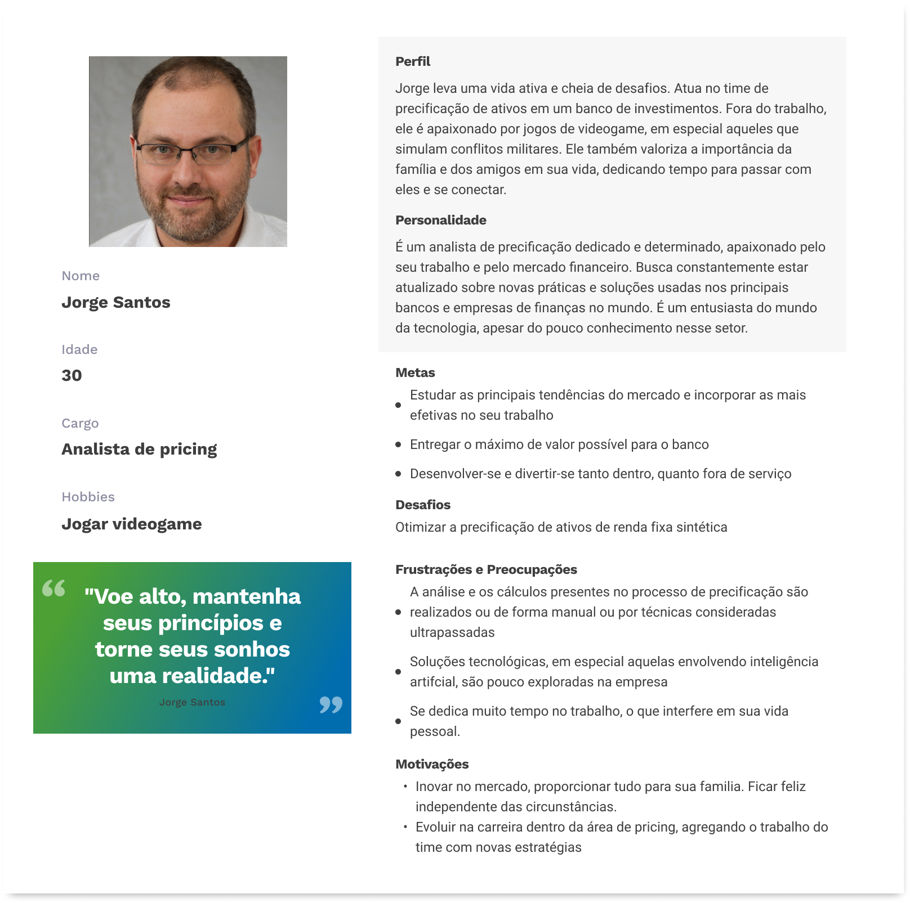
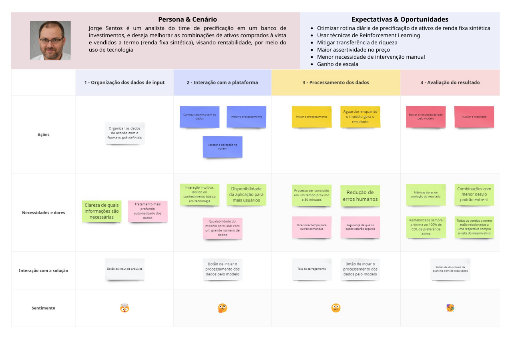

# Entendimento do usuário

## User Stories

As "User Stories" são uma técnica utilizada em métodos ágeis para capturar requisitos de software do ponto de vista do usuário. São declarações concisas de um desejo ou necessidade do usuário. A metodologia INVEST é um conjunto de critérios usados para garantir que uma User Story seja bem definida e útil. INVEST é um acrônimo para Independent, Negotiable, Valuable, Estimable, Small e Testable.

A partir dessas definições, a seguinte tabela consolida os requisitos do projeto em questão, a fim de que a aplicação seja desenvolvida a partir dessa referência.

| Épico     | Prioridade | Complexidade (Fibonacci) | User Story                                                                                                                                                                                            |       Status       |
| --------- | :--------: | :----------------------: | ----------------------------------------------------------------------------------------------------------------------------------------------------------------------------------------------------- | :----------------: |
| Principal |     10     |            13            | Eu, como analista de precificação, quero inserir uma planilha com valores de ativos a termo e à vista para que a IA possa entregar a melhor combinação possível                                       | Em desenvolvimento |
| Principal |     10     |            21            | Eu, como analista de precificação, quero obter uma planilha com combinações de pontas a termo e a vista baseadas em 100% do CDI para que o banco tenha suas metas atingidas                           | Em desenvolvimento |
| Principal |     10     |            21            | Eu, como analista de precificação, quero que as combinações dos ativos a termo e à vista tenham o menor desvio padrão entre si para que saiba que a rede neural entregou a melhor combinação possível | Em desenvolvimento |
| Principal |     10     |            5             | Eu, como analista de precificação, quero que a aplicação que combina ativos esteja na nuvem, para que todos os colaboradores da área possam utilizar a solução                                        | Em desenvolvimento |
| Desejável |     6      |            8             | Eu, como analista de precificação, quero que o resultado das combinações dos ativos ocorra em menos de 30 minutos, para que tenha vantagens competitivas                                              | Em desenvolvimento |

## Persona

Uma persona é uma representação fictícia de um cliente ideal, baseada em dados reais e pesquisas sobre os usuários reais de um produto, serviço ou sistema. Ela incorpora características demográficas, comportamentais, necessidades, objetivos, motivações e desafios típicos do público-alvo.

## User Journey Map

Um mapa de jornada do usuário é uma representação visual que mostra a experiência completa de um usuário ao interagir com um produto, serviço ou sistema ao longo do tempo. Ele detalha as etapas que um usuário passa, desde o momento em que inicia o contato com o produto até o término de sua jornada, destacando suas ações, necessidades / dores, interações e sentimentos com a solução.

