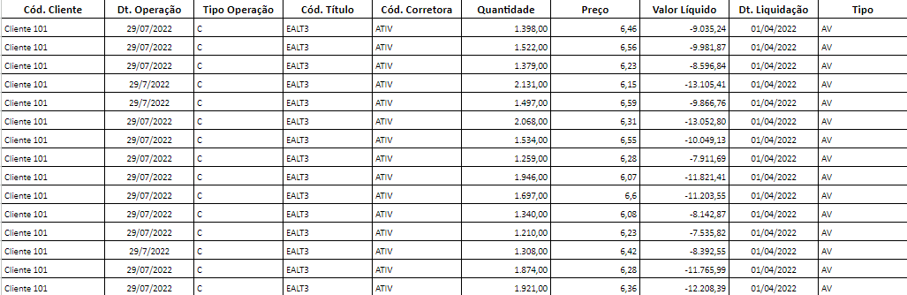
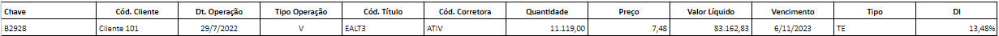
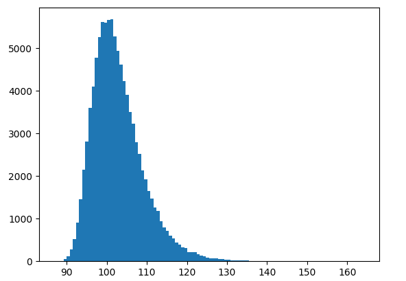
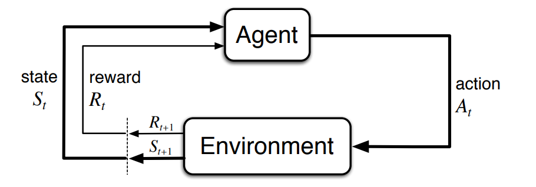

# Modelagem do Problema e Definição da Solução

## 1. Modelagem Estatística
### 1.2 Entendimento das variáveis
#### Compra
- **Cód.** 
- **Cliente** 
- **Dt. Operação** 	
- **Tipo Operação**	
- **Cód. Título**	
- **Cód. Corretora**	
- **Quantidade**	
- **Preço	Valor** 
- **Líquido**
- **Dt. Liquidação**

#### Venda 
- **Chave** :
- **Cód. Cliente**	
- **Dt. Operação**	
- **Tipo Operação**	
- **Cód. Título**	
- **Cód. Corretora**	
- **Quantidade**	
- **Preço	Valor Líquido**	
- **Vencimento**	
- **Tipo**	
- **DI**

### 1.3 Modelagem do problema
Para essa modelagem foi escolhido alguns dados das planilhas oferecidas pelo parceiro, seguem elas abaixo:
### Dados de compra

### Dados de venda

A partir disso foi criado o seguinte modelo:
- Tendo em vista o principal objetivo de atingir 100 por cento do CDI, ultilizar a abordagem de fragmentar as anções avista (de maneira semelhante ao knapsack problem), faz com que que seja maximizada a ocorrencias de 100 porcento do CDI. A patir dessa analise incial, deduz-se que, realizar os casamentos ultilizando em uma primeira iteração 10 por cento, seguida de um achescimo de 10 por cento para a proxima iteração de cada ação a vista, pode se atingir esse objetivo.

### 1.4 Abordagem
### 1.5 Dsitribuição do CDI 
Para entender qual a distribuição desejada, foi plotado um grafico, que disperça o CDI em um gráfico de distribuição. Os valores desejados que tenham maior ocorrencia, giram em torno dos 100 por cento do CDI, já valores abaixo de 90 e 130 porcento, não devem ter nenhum tipo de ocorrencia. Na visao geral, esse seriam os valores ideiais para a distribuição.

## 2. Escolha da Abordagem de Otimização 

Para melhor escolha da abordagem de otimização, precisamos levar em conta o _ambiente_ e o _agente_ do modelo, sendo o agente a entidade que toma decisões e o ambiente compreende tudo externo ao agente e que leva dados à ele. O agente, em período $t$, que se encontra no estado $S_t$ e recebeu a recompensa $R_t$, realiza a ação $A_t$, que é "enviada" pelo ambiente. O ambiente, por sua vez, devolve uma compensa $R_{t+1}$ e o estado $S_{t+1}$ que são consequências de $A_t$. Assim, o ciclo se repete, com o agente fazendo escolhas baseadas nas recompensas e nos dados do estado recebidos. Abaixo, podemos visualizar um diagrama do explicado acima:

Fonte: Livro Reinforcement Learning - An introduction

 

A partir das informações acima e do problema dado em [Entendimento de Negócios](/docs/entendimentoDeNegocios.md), na sessão 3: _Descrição da solução a ser desenvolvida_, foi desenvolvido o seguinte esquema de agente ambiente:

### 2.1. Ambiente

Existem características principais que o ambiente deve devolver ao agente, porém essas características podem ser expressas de maneiras diferentes. Diferentes expressões levam à diferentes funções de recompensa e, como consequência, diferentes resultados do modelo. Podemos usar como exemplo a distância do número exato de ordens à vista que devem ser incluídas/selecionadas. Isso pode ser feito dizendo ao agente quantas ordens _faltam_ para chegar na contagem perfeita (cenário 1) ou quantas ordens _já foram_ incluídas/selecionadas e qual é a _contagem_ da quantidade perfeita (cenário 2). Esse exemplo pode ser expresso por identificadores diferentes em cada cenário, como mostrado a seguir:

| Cenário 1                               | Cenário 2                                 |
| --------------------------------------- | ----------------------------------------- |
| `remainingToPerfectOrdersQuantityCount` | `includedOrdersCount` & `perfectQuantity` |

Esses retornos que o ambiente deve dar ao agente podem ser expressos como dados variáveis (como `ordersToPerfectCount`) ou constantes (como `perfectQuantity`). A seguir, serão descritos todos os retornos que o ambiente pode fornecer ao agente para formação de estados:

- **Listagem de ordens ainda disponíveis para escolha**
  - `availableOrders`
  - Variável
  - Assume o formato de uma lista de ordens com os campos (colunas) descritos na sessão [1.1.1. Escolha da Abordagem da Modelagem](#111-modelagem-estatística)
- **Porcentagem do CDI alcançada**
  - `currentCdiPercentage`
  - Variável
  - Como mostrado na sessão _3.1 - O problema_ no documento [Entendimento de Negócios](./entendimentoDeNegocios.md), a porcentagem em relação ao CDI pode ser calculada com base na média da ações de compra à vista escolhidas. Portanto, a variável `currentCdiPercentage` dirá a média atual em porcentagem do CDI alcançada com base na média das ações já escolhidas

### 2.2. Agente

Assume-se que os dados que irão alimentar a interface agente-ambiente estejam todas unitárias, ou seja, que todas as ações da ponta à vista foram separadas em ações fracionárias.

O problema desenvovido tem um agente principal, esse tendo as seguintes possíveis ações:

- **Incluir de uma ação fracionária (unitárias) para compor o casamento**
  - `includeUnitOrder`;
  - Se trata da ação mais simples que o agente pode ter: incluir uma ação fracionária à vista na lista de ações selecionadas;

### 2.3. Possibilidades descartadas

Foi também discutida a possibilidade de incluir outras opções de ações do agente, como:

- **Criação/formação de blocos de ações**
  - `createBlock`;
  - Unificação de ações fracionárias em um bloco, procurando alcançar a média mais próxima possível à media ideal a ser alcançada;
  - Foi discutida a possibilidade da ação ser redundante em comparação com escolher uma ação à vista por vez por ação do agente (`includeUnitOrder`), porém, após reflexão, foi concluído que formar blocos com uma média ideal a ser alcançada obrigaria o agente a "olhar pra frente", o que não pode ser alcançado apenas com `includeUnitOrder`. Outro ponto observado é que `includeUnitOrder` poderia ser custoso, pois o balanceamento da média seria feito com mais de uma ação;
- **Quebrar de blocos de orders**
  - `breakBlock`;
  - O bloco será quebrado em ações fracionárias;
- **Escolha de um bloco de ações;**
  - `includeBlockOfOrders`;
  - Assim como podemos incluir uma ação fracionária, podemos incluir um bloco criado pelo próprio agente na lista de ações incluídas;

Porém, como se trata de uma rede de aprendizado por reforço, é esperado que a rede aprenda que tem que alcançar a média de preço ideal. Por isso, a criação de blocos para escolha posterior seria redundante. Além disso, o grupo não conseguiu chegar à uma forma de calcular a média ideal de preço da ponta à vista para alcançar 100% do CDI, o que é um impeditivo para as ações descritas acima.

Outros identificadores do ambiente também foram discutidas para adição ao modelo, como:

- **Quantidade perfeita de ordens a serem incluídas**
  - `includedOrdersCount`: variável que conta quantas ordens já foram incluídas;
  - `perfectQuantity`: constante que informa a quantidade perfeita que deve ser alcançada. É perfeita porque, por recgra de negócios, o resultado dado pela rede não pode se diferenciar dela;
  - As variáveis e constantes descritas na sessão acabam sendo inúteis, pois serviriam como critério de parada do modelo, que, por sua vez, vai ser expresso pelo estado $S_t$ em que o agente irá se encontrar. Se o estado mostra que a quantidade perfeita de ordens à vista foi atingida, o modelo não permitirá mais nenhuma ação do agente, ou seja, o modelo para.
- **Distância de 100% do CDI**
  - `idealOrdersPriceMean`;
  - constante;
  - Média ideal do preço das ordens à vista para alcançar 100% do CDI, que seria calculada com base nas fórmulas dadas em _3.1 - O problema_ no documento [Entendimento de Negócios](./entendimentoDeNegocios.md). Porém, foi descartada por conta de a fórmula alcançada é inviável para ser calculada computacionalmente;
  - `currentPriceMean`;
  - Variável;
  - A média atual da rentabilidade;

## 3. Proposta de funções de recompensa

## 4. Testes Iniciais em Código
